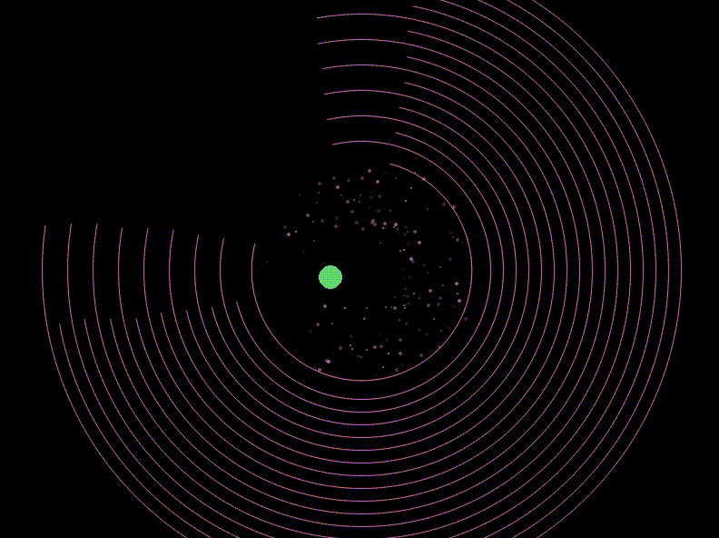

# TikTok ADHD Trap 🎯✨

> **Vibe-Coded**: created by neural networks (GitHub Copilot + GPT-4.1)

[🇷🇺 Read in Russian](README.md)

---



## What is this? 🤔

**TikTok ADHD Trap** is not a game, but a mesmerizing process that's just nice to watch! A super-energetic ball endlessly bounces off spinning rings with gaps. This kind of visual is often used in TikTok and Reels to grab and hold attention, and to create a chill vibe.

- 🎨 Random colors, sizes, speeds, and number of rings
- 💥 Realistic yet chaotic physics
- 🔄 Endless process — just watch and relax
- ✨ Beautiful particles and effects
- 🤖 Everything generated by neural networks (Vibe-Coded)
- 🎨 Everything can be customized, randomized, and edited

---

## How to run? 🚀

1. Install Python 3.8+
2. Install dependencies:
   ```bash
   pip install pygame
   ```
3. Run:
   ```bash
   python adhd.py
   ```

---

## Controls 🕹️

- Just watch! Everything happens automatically.
- You can change the sound for ring destruction: put your sound as `break.wav` in the `sounds` folder.

---

## Why is it cool? 😎

- Used in TikTok to grab and hold attention
- Absolutely unpredictable visuals
- You can zone out and watch forever

---

## Credits 🙏

- 🤖 [GitHub Copilot](https://github.com/features/copilot)
- 🤖 [OpenAI GPT-4.1](https://openai.com/research/gpt-4)
- 🕹️ [pygame](https://www.pygame.org/)

---

[🇷🇺 Читать на русском](README.md)

> **Vibe-Coded**: just watch the chaos and do nothing! (even this README was generated by AI) ✨
